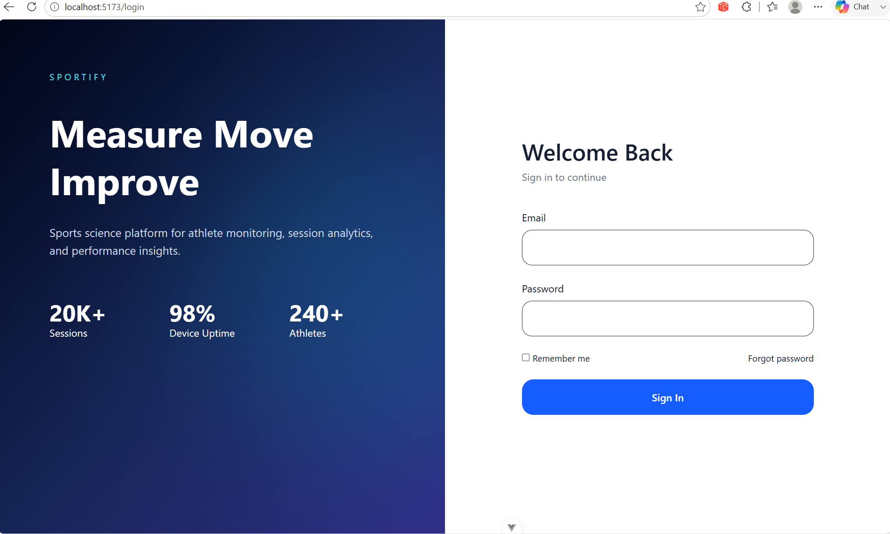
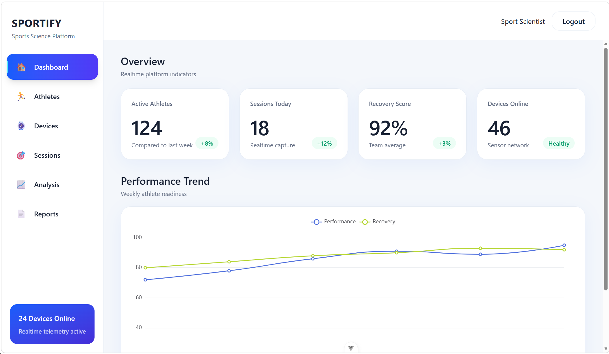
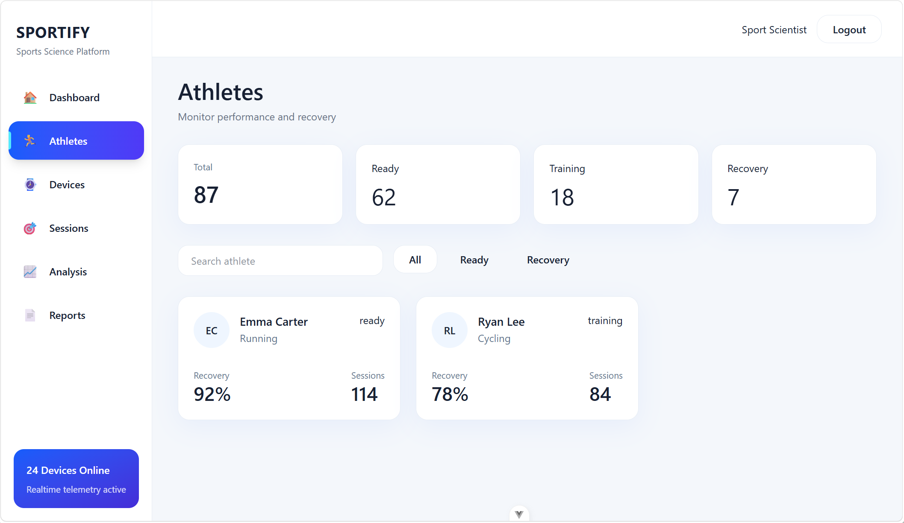
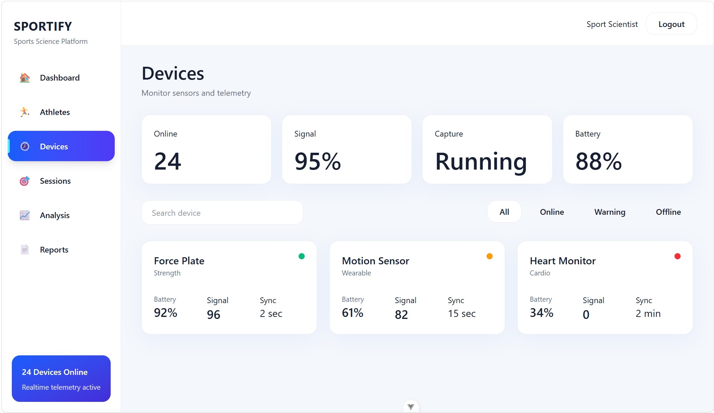

# SPORTIFY

Sports Science Performance Control Center

A modern sports-science platform for athlete monitoring, session execution, realtime telemetry, performance analysis, and reporting.

Built with Vue 3, TypeScript, Vite, Tailwind, Storybook, Pinia, and ECharts.

---

## Overview

SPORTIFY is designed as a professional sports performance management platform.

The system supports:

* Athlete management
* Device monitoring
* Session planning and execution
* Realtime telemetry visualization
* Performance analytics
* Reporting and insights

---

## Demo Screenshots

### Login



### Dashboard



### Athletes



### Devices



### Device Monitor


---

## Product Features

### Authentication

* Login / Logout
* Persistent login state
* Route protection
* Role-ready architecture

### Dashboard

* KPI overview
* Performance Trend charts
* Operational monitoring

### Athletes

* Athlete list
* Profile cards
* Training indicators

### Devices

* Device status
* Health monitoring
* Connectivity management

### Sessions

* Session management
* Multi-step session creation
* Device assignment
* Capture configuration
* Session lifecycle

### Live Monitoring

* Realtime metrics
* Streaming charts
* Session timer
* Pause / Resume / Stop

### Analysis

* Force analysis
* Velocity analysis
* Recovery analysis

### Reports

* ECharts visualization
* Historical trend reporting

---

## Tech Stack

| Layer         | Technology   |
| ------------- | ------------ |
| Framework     | Vue 3        |
| Language      | TypeScript   |
| Build         | Vite         |
| Styling       | Tailwind CSS |
| State         | Pinia        |
| UI Primitive  | Reka UI      |
| Charts        | ECharts      |
| Documentation | Storybook    |
| Router        | Vue Router   |

---

## Project Structure

```plaintext
src/

styles/
theme.css
tailwind.css

layouts/

components/

shared/
ui/
hooks/
lib/

features/
auth/
dashboard/
athlete/
device/
session/
analysis/
report/

views/

router/

stores/

types/
```

---

## Architecture

```plaintext
shared

↓

layouts

↓

features

↓

views
```

Rules:

* shared cannot import features
* layouts should remain business-agnostic
* features own business logic
* views stay thin

---

## Session Lifecycle

```plaintext
Draft

↓

Configured

↓

Running

↓

Completed

↓

Analyzed

↓

Reported
```

---

## Local Development

Install dependencies:

```bash
pnpm install
```

Start development:

```bash
pnpm dev
```

Run Storybook:

```bash
pnpm storybook
```

Build:

```bash
pnpm build
```

Preview:

```bash
pnpm preview
```

---

## Environment

Create:

```bash
.env.local
```

Example:

```env
VITE_API_BASE_URL=http://localhost:8080
VITE_ENABLE_MOCK=true
```

---

## Coding Standards

* TypeScript strict mode
* Composition API
* Feature-first structure
* Shared UI primitives
* Tailwind utility-first styling

---

## Future Roadmap

### Phase 1

* Authentication
* Dashboard
* Sessions

### Phase 2

* Device integration
* Realtime streaming
* Telemetry replay

### Phase 3

* AI insights
* Team analytics
* Mobile support

---

## License

Internal Demo Project
